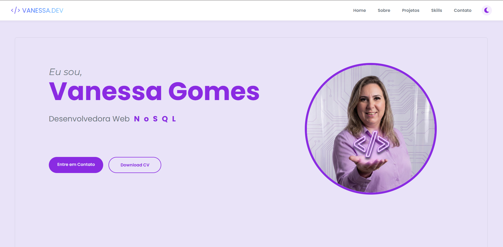

# Portfólio Vanessa Gomes | Desenvolvedora WEB

<p align="center">
  <a href="https://vanessa-gomes-portifolio.vercel.app/" target="_blank">
    
  </a>
  
</p>

## Tecnologias Utilizadas

| Categoria | Tecnologia | Badge |
| :--- | :--- | :--- |
| **Front-end** | React |  |
| **Linguagem** | TypeScript |  |
| **Estilização** | Styled Components |  |
| **Animações** | Framer Motion |  |
| **Ambiente/Tooling** | Vite |  |
| **Deploy** | Vercel |  |
| **Back-end** | Node.js |  |

---

## Preview do Projeto

```markdown
<p align="center">
  
</p>

## Sobre o Projeto
Este é o portfólio profissional de Vanessa Gomes, Desenvolvedora Full Stack com foco em arquitetura moderna e experiência do usuário.

O projeto é construído como um Single Page Application (SPA) utilizando React e visa apresentar uma coleção de projetos pessoais e profissionais, demonstrando habilidades em desenvolvimento Front-end interativo e responsivo.

## Principais Funcionalidades
Responsividade Aprimorada: Layouts otimizados para todos os dispositivos (mobile, tablet, desktop).

Animações Fluídas: Utilização do Framer Motion para transições e movimentos atraentes.

Rotas Dinâmicas: Navegação interna gerenciada pelo react-router-dom.

API de Contato: Formulário de contato funcional integrado (via API em Node.js - caminho para back-end não incluso neste repositório).

## Principais Correções Recentes (Pós-Deploy)
A estabilidade e responsividade foram garantidas através dos seguintes ajustes:

Layout da Home: Corrigida a quebra do título "Vanessa Gomes" em telas de desktop e monitores extra grandes (min-width: 1600px) através da otimização do line-height e max-width do contêiner.

Acesso a Assets (404): Corrigido o erro de código 404 Not Found no acesso a imagens e arquivos estáticos (como a foto de perfil e imagens de projetos) movendo-os corretamente para a pasta public/ e ajustando os caminhos absolutos.

Download de CV: O link do botão "Download CV" foi corrigido para buscar o arquivo PDF diretamente da raiz da pasta public/, resolvendo o erro de download.

Rotas na Vercel (404): Implementação da configuração de reescrita (vercel.json) para garantir que o roteamento de SPA funcione corretamente no ambiente de produção, resolvendo o erro 404 ao tentar acessar rotas diretas como /contato.

Responsividade do Contato: Ajustada a disposição e largura dos cards de contato (WhatsApp, LinkedIn, etc.) em dispositivos móveis, evitando que ultrapassem as margens laterais.

## Documentação Técnica
Estrutura do Projeto
O projeto segue a estrutura padrão do Vite, mas está organizado em pastas lógicas:

````
├── public/ 
│   ├── cv-vanessa.pdf     # Arquivos estáticos acessíveis via '/'
│   ├── perfil-vanessa.jpeg
│   └── ... imagens de projetos
├── src/
│   ├── components/        # Componentes reutilizáveis (Header, RotatingText, etc.)
│   ├── data/              # Arquivos de dados (projetos, skills)
│   ├── pages/             # Componentes de página (Home, About, Contact, Projects)
│   ├── styles/            # Estilos globais e temas (Styled Components)
│   └── App.tsx            # Configuração de rotas (react-router-dom)
└── vercel.json            # Regras de reescrita para Vercel (SPA routing)
````
## Instalação e Execução (Ambiente Local)
Para rodar o projeto em sua máquina, siga os passos abaixo:

Pré-requisitos
Node.js (v18+)

pnpm (Recomendado) ou npm

1. Clonar o Repositório

´´´´
git clone [https://github.com/vanessagomes-dev/vanessa_gomes_desenvolvedora.git](https://github.com/vanessagomes-dev/vanessa_gomes_desenvolvedora.git)
cd vanessa_gomes_desenvolvedora
´´´´

2. Instalar Dependências

````
pnpm install
# ou
npm install
````

3. Executar o Projeto
Inicia o servidor de desenvolvimento do Vite com Hot Module Replacement (HMR):

´´´´
pnpm dev
# ou
npm run dev
´´´´
O projeto estará acessível em http://localhost:5173/ (ou outra porta disponível).

4. Build para Produção
Cria o bundle otimizado na pasta dist/:

´´´´
pnpm build
# ou
npm run build
´´´´

## 🔗 Conecte-se com a Desenvolvedora

Plataforma,Link
LinkedIn,https://linkedin.com/in/vanessagomesdev
GitHub,https://github.com/vanessagomes-dev
E-mail,vanessagomesdev@gmail.com


# React + TypeScript + Vite

This template provides a minimal setup to get React working in Vite with HMR and some ESLint rules.

Currently, two official plugins are available:

- [@vitejs/plugin-react](https://github.com/vitejs/vite-plugin-react/blob/main/packages/plugin-react) uses [Babel](https://babeljs.io/) (or [oxc](https://oxc.rs) when used in [rolldown-vite](https://vite.dev/guide/rolldown)) for Fast Refresh
- [@vitejs/plugin-react-swc](https://github.com/vitejs/vite-plugin-react/blob/main/packages/plugin-react-swc) uses [SWC](https://swc.rs/) for Fast Refresh

## React Compiler

The React Compiler is currently not compatible with SWC. See [this issue](https://github.com/vitejs/vite-plugin-react/issues/428) for tracking the progress.

## Expanding the ESLint configuration

If you are developing a production application, we recommend updating the configuration to enable type-aware lint rules:

```js
export default defineConfig([
  globalIgnores(['dist']),
  {
    files: ['**/*.{ts,tsx}'],
    extends: [
      // Other configs...

      // Remove tseslint.configs.recommended and replace with this
      tseslint.configs.recommendedTypeChecked,
      // Alternatively, use this for stricter rules
      tseslint.configs.strictTypeChecked,
      // Optionally, add this for stylistic rules
      tseslint.configs.stylisticTypeChecked,

      // Other configs...
    ],
    languageOptions: {
      parserOptions: {
        project: ['./tsconfig.node.json', './tsconfig.app.json'],
        tsconfigRootDir: import.meta.dirname,
      },
      // other options...
    },
  },
])
```

You can also install [eslint-plugin-react-x](https://github.com/Rel1cx/eslint-react/tree/main/packages/plugins/eslint-plugin-react-x) and [eslint-plugin-react-dom](https://github.com/Rel1cx/eslint-react/tree/main/packages/plugins/eslint-plugin-react-dom) for React-specific lint rules:

```js
// eslint.config.js
import reactX from 'eslint-plugin-react-x'
import reactDom from 'eslint-plugin-react-dom'

export default defineConfig([
  globalIgnores(['dist']),
  {
    files: ['**/*.{ts,tsx}'],
    extends: [
      // Other configs...
      // Enable lint rules for React
      reactX.configs['recommended-typescript'],
      // Enable lint rules for React DOM
      reactDom.configs.recommended,
    ],
    languageOptions: {
      parserOptions: {
        project: ['./tsconfig.node.json', './tsconfig.app.json'],
        tsconfigRootDir: import.meta.dirname,
      },
      // other options...
    },
  },
])
```
